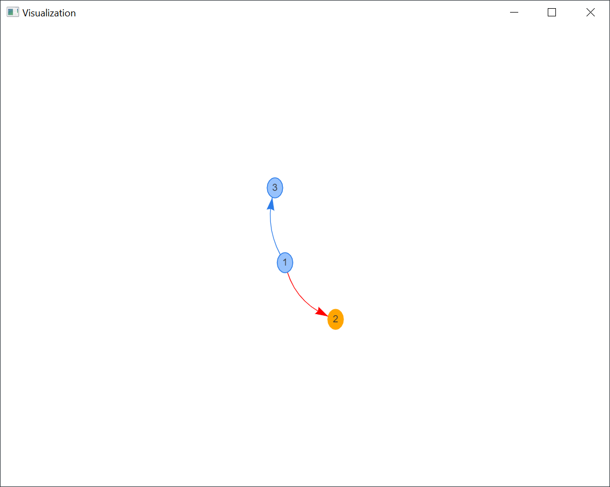
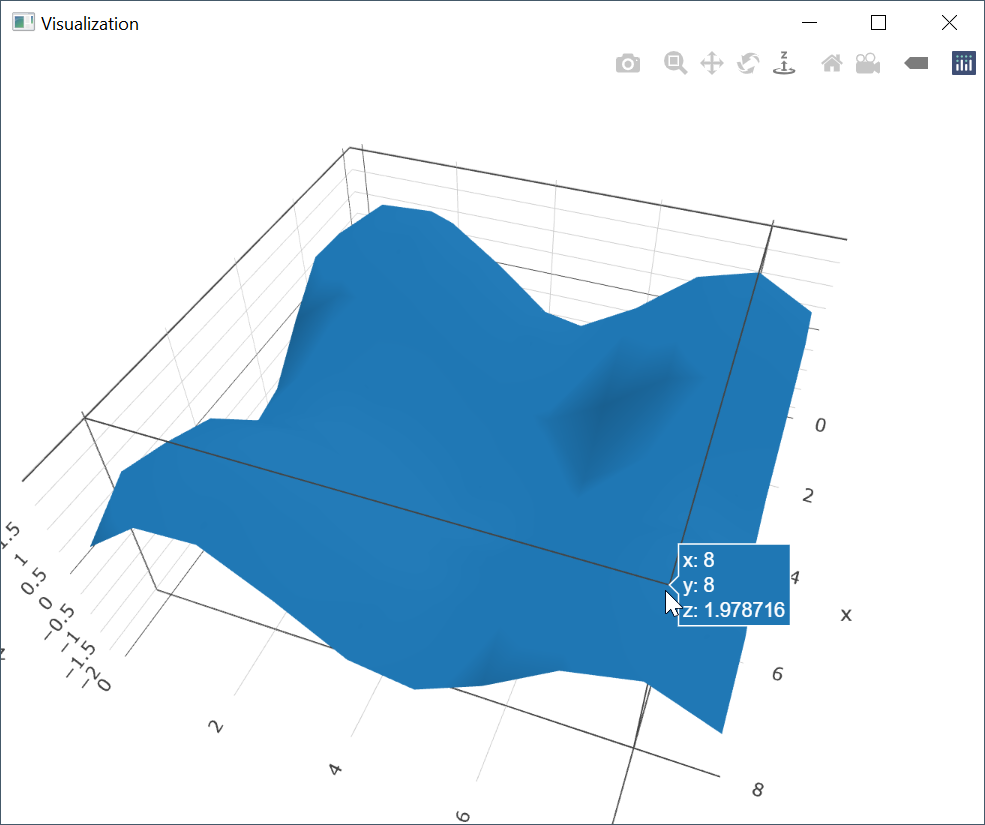

# Visualizer CLI

A tool to visualize data.
[See this playground](https://hediet.github.io/visualization/) for which data can be visualized.

Based on [@hediet/visualization](https://github.com/hediet/visualization) which also powers
the [Debug Visualizer extension for VS Code](https://github.com/hediet/vscode-debug-visualizer).

## Installation

```
cargo install visualizer-cli
```

## Example: Visualize A Directed Graph

```sh
cat data.json | visualize
```

With `data.json`:

```json
{
    "$schema": "https://hediet.github.io/visualization/docs/visualization-data-schema.json",
    "kind": { "graph": true },
    "nodes": [
        { "id": "1", "label": "1" },
        { "id": "2", "label": "2", "color": "orange" },
        { "id": "3", "label": "3" }
    ],
    "edges": [
        { "from": "1", "to": "2", "color": "red" },
        { "from": "1", "to": "3" }
    ]
}
```



## Example: Visualize A 3D Plot

```sh
cat data.json | visualize
```

With `data.json`:

```json
{
    "$schema": "https://hediet.github.io/visualization/docs/visualization-data-schema.json",
    "kind": {
        "plotly": true
    },
    "data": [
        {
            "type": "mesh3d",
            "x": [ 0, 0, 0, ... ],
            "y": [ 0, 1, 2, ... ],
            "z": [ 0, 0.84, 0.9, ... ]
        }
    ]
}

```



## API / Rust Usage

See the `visualizer` crate.

# Architecture

This CLI uses Tauri/WRY to host a webview which loads [@hediet/visualization](https://github.com/hediet/visualization).
